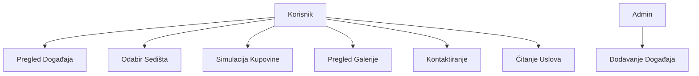
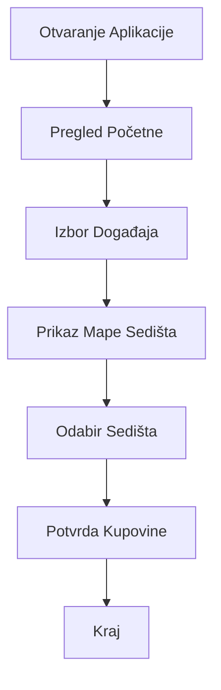
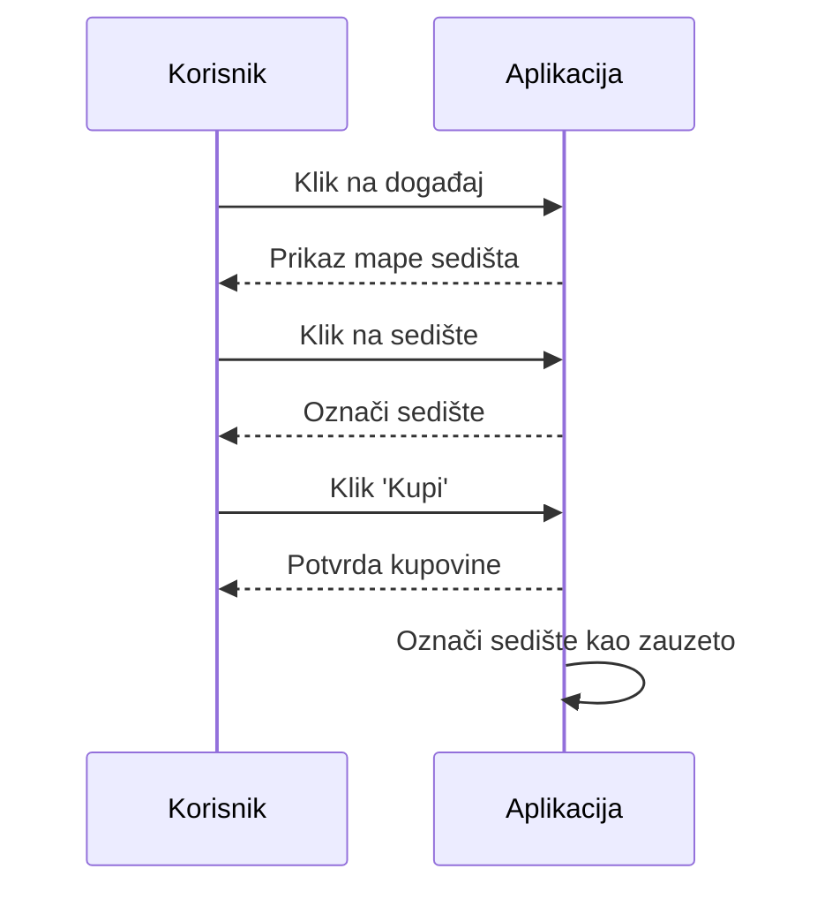
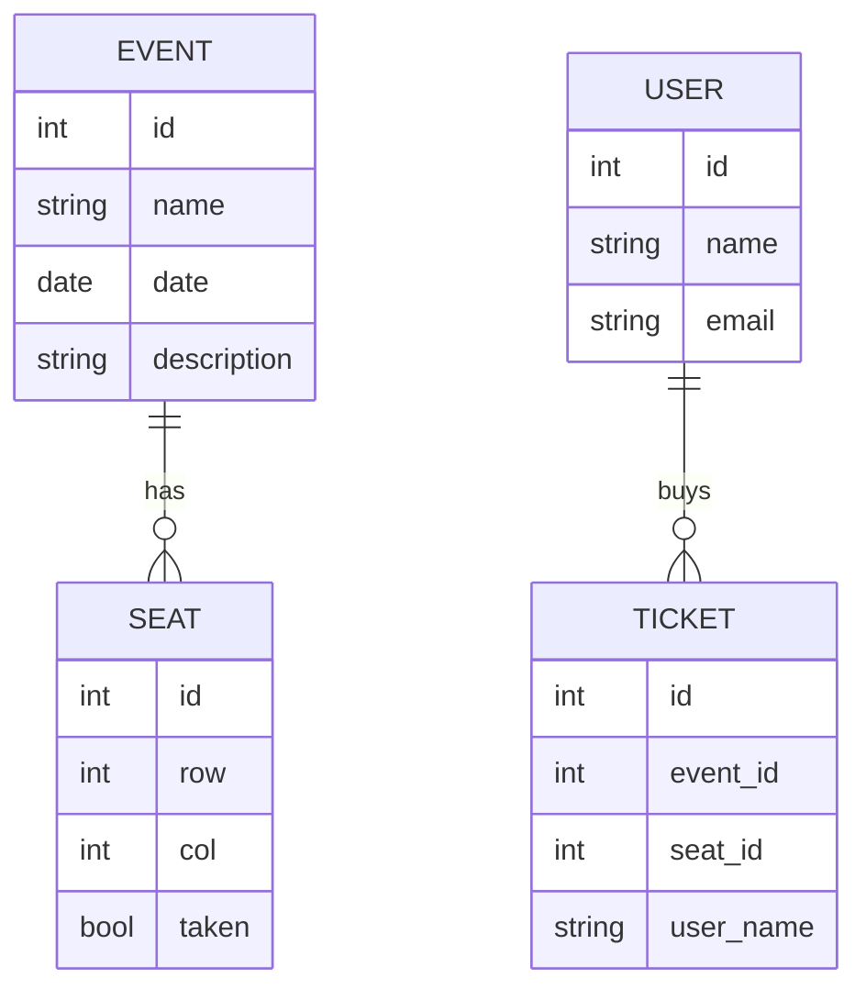
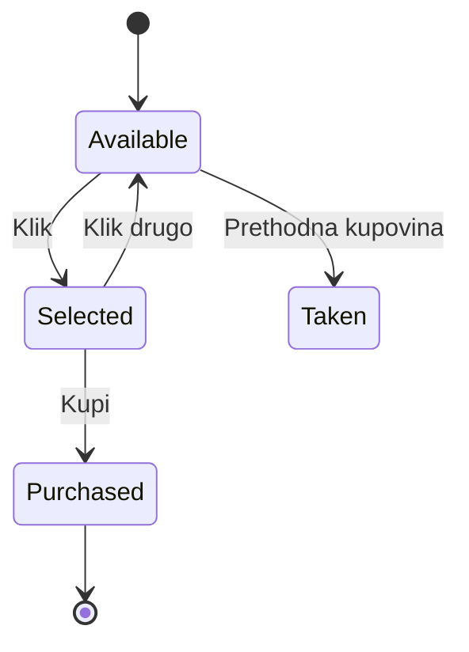

# Kompleksna Dokumentacija Projekta: Sistem za Prodaju Karata za Klub

## Uvod u Temu i Motivacija

Ovaj projekat se fokusira na razvoj web aplikacije za prodaju karata za muzičke događaje u klubu. Motivacija proizlazi iz potrebe za efikasnim i jednostavnim sistemom koji omogućava korisnicima da pregledaju događaje, biraju sedišta i simuliraju kupovinu karata. Aplikacija je dizajnirana kao demo sistem, bez realnih transakcija ili baze podataka, ali sa profesionalnim UI/UX-om prilagođenim temi kluba.

## Opis Problema

Klubovi često organizuju različite muzičke događaje (koncerti bendova, DJ žurke), ali nedostaje jednostavan online sistem za prodaju karata. Postojeći sistemi su skupi ili prekomplikovani za male klubove. Ovaj projekat rešava problem pružajući demo aplikaciju koja simulira ceo proces, omogućavajući korisnicima da vide dostupna sedišta i "kupe" karte bez stvarnih finansijskih transakcija.

## Stejkholderi

- **Vlasnik Kluba**: Investira u sistem, koristi ga za promociju događaja i upravljanje prodajom.
- **Posetioci Kluba**: Krajnji korisnici koji kupuju karte i prisustvuju događajima.
- **Administrator Sistema**: Održava aplikaciju, dodaje nove događaje i upravlja sadržajem.
- **Asistent/Profesor**: Prate razvoj projekta, daju povratne informacije.
- **Razvojni Tim**: Studenti koji implementiraju i testiraju aplikaciju.

## Ciljni Korisnici

Primarni ciljni korisnici su mladi odrasli (18-35 godina) zainteresovani za muziku i noćni život. Sistem je dizajniran da bude intuitivan, sa mobilnim responsive dizajnom, kako bi se koristio na različitim uređajima.

## Glavni Ciljevi Projekta

1. Kreirati funkcionalnu web aplikaciju za pregled i kupovinu karata.
2. Obezbediti korisničko iskustvo prilagođeno temi kluba.
3. Demonstrirati profesionalne softverske prakse (verzionisanje, dokumentacija).
4. Ispuniti zahteve predmeta SE425 za P1 i P2 faze.

## Analiza Zahteva

### Funkcionalni Zahtevi

1. **Pregled Događaja**: Korisnik može videti listu nadolazećih događaja sa osnovnim informacijama.
2. **Detalji Događaja**: Prikaz mape sedišta sa dostupnim i zauzetim mestima.
3. **Odabir Sedišta**: Klikom na dostupno sedište, korisnik ga bira.
4. **Simulacija Kupovine**: Potvrda kupovine karte bez realne transakcije.
5. **Informacije o Klubu**: Stranica sa opisom i slikama.
6. **Galerija**: Prikaz slika prethodnih događaja.
7. **Kontakt**: Forma za slanje poruka (statička).
8. **Uslovi Korišćenja**: Prikaz pravila.

### Nefunkcionalni Zahtevi

1. **Performanse**: Aplikacija mora biti brza, sa vremenom učitavanja <2s.
2. **Korisnički Interfejs**: Moderni, responsive dizajn sa tamnom temom prilagođenom klubu.
3. **Bezbednost**: Osnovna validacija ulaza, bez osetljivih podataka.
4. **Kompatibilnost**: Radi u modernim browserima (Chrome, Firefox, Safari).
5. **Skalabilnost**: Jednostavan kod za buduća proširenja (npr. baza podataka).

## Use Case Scenariji

1. **Pregled Događaja**: Korisnik otvara početnu stranu, vidi hero sekciju i listu događaja.
2. **Odabir Sedišta**: Korisnik bira događaj, vidi mapu sedišta, klikne na zeleno sedište, potvrdi kupovinu.
3. **Pregled Galerije**: Korisnik poseti galeriju da vidi slike događaja.
4. **Kontaktiranje**: Korisnik popuni kontakt formu (bez slanja).
5. **Čitanje Uslova**: Korisnik pročita pravila sajta.

## Tehnike Prioritizacije Zahteva (MoSCoW)

- **Must Have**:
  - Pregled događaja
  - Odabir i kupovina sedišta
  - Responsive dizajn

- **Should Have**:
  - Galerija i kontakt
  - Hero sekcija na početnoj

- **Could Have**:
  - Dodatne animacije
  - Više događaja

- **Won't Have**:
  - Realne transakcije
  - Korisnički nalozi
  - Baza podataka

## Definicija MVP-a (Minimum Viable Product)

MVP uključuje osnovne funkcionalnosti: početnu stranu sa događajima, mapu sedišta, simulaciju kupovine, galeriju, kontakt i uslove. Dizajn je klubski, sa slikama sa interneta. Sistem koristi in-memory podatke, bez baze.

## Potrebni Dijagrami

### Use Case Dijagram



### Activity Dijagram



### Sequence Dijagram (za Kupovinu Karte)



### Dijagram Arhitekture Sistema

```mermaid
graph TD
    A[Browser] --> B[Flask App]
    B --> C[Templates HTML]
    B --> D[Static CSS/JS]
    B --> E[In-Memory Data]
    Note over E: Events, Seats
```

## Tehnologije Koje će Biti Korišćene

- **Backend**: Python 3.12, Flask 3.0
- **Frontend**: HTML5, CSS3 (sa Flexbox/Grid), JavaScript (ES6)
- **Verzionisanje**: Git
- **Organizacija**: Trello
- **Dokumentacija**: Markdown
- **Dijagrami**: Mermaid (za Draw.io)

## Plan Implementacije i Vremenska Linija

### Faza P1 N1: Dokumentacija
- Trajanje: 1 nedelja
- Aktivnosti: Pisanje uvodne dokumentacije, analiza zahteva, kreiranje dijagrama.

### Faza P1 N2: Prototip
- Trajanje: 2 nedelje
- Aktivnosti: Implementacija osnovnih ruta, dizajn UI, dodavanje slika.

### Faza P2 N1: Finalna Dokumentacija
- Trajanje: 1 nedelja
- Aktivnosti: Proširenje dokumentacije sa implementacionim detaljima.

### Faza P2 N2: Funkcionalna Aplikacija
- Trajanje: 2 nedelje
- Aktivnosti: Proširenje funkcionalnosti (ako potrebno), testiranje, finalizacija.

Ukupno vreme: 6 nedelja.

## Reference i Prilozi

- Flask Dokumentacija: https://flask.palletsprojects.com/
- Unsplash za slike: https://unsplash.com/
- Mermaid Dijagrami: https://mermaid.js.org/

## Detaljna Analiza Zahteva

### Funkcionalni Zahtevi - Detalji

1. **Pregled Događaja**:
   - Ulaz: Korisnik pristupa / ili /home.
   - Proces: Prikaz hero sekcije, info bloka, liste događaja u karticama.
   - Izlaz: HTML stranica sa navigacijom.
   - Alternativni tokovi: Ako nema događaja, prikaži poruku.

2. **Detalji Događaja**:
   - Ulaz: Klik na "Kupi Karte" za događaj.
   - Proces: Generisanje 10x10 grid-a sedišta, označavanje zauzetih.
   - Izlaz: Interaktivna mapa.
   - Validacija: Provera da li događaj postoji.

3. **Odabir Sedišta**:
   - Ulaz: Klik na sedište.
   - Proces: JS promena klase, onemogućavanje drugih.
   - Izlaz: Izabrano sedište.
   - Greška: Ako sedište zauzeto, alert.

4. **Simulacija Kupovine**:
   - Ulaz: POST zahtev sa event_id i seat_id.
   - Proces: Validacija, ažuriranje taken_seats, redirect na confirmation.
   - Izlaz: Potvrda stranica.
   - Bezbednost: Osnovna provera.

5-8. Slično za ostale funkcionalnosti.

### Nefunkcionalni Zahtevi - Detalji

- **Performanse**: Mere se sa browser dev tools; cilj <2s za inicijalno učitavanje.
- **UI/UX**: Koristi se Google Material Design inspiracija za tamnu temu.
- **Bezbednost**: Nema SQL injection (nema DB), XSS prevencija sa Flask-om.
- **Pristupačnost**: Alt tekstovi za slike, kontrast boja >4.5:1.
- **Skalabilnost**: Kod je modularan, lako dodati DB ili auth.

## Prošireni Use Case Scenariji

1. **Osnovni Tok**: Kao prethodno.
2. **Alternativni Tok - Sedište Zauzeto**: Korisnik klikne zauzeto sedište, dobije poruku "Nije dostupno".
3. **Izuzetni Tok - Greška**: Server greška, prikaži 500 stranu.
4. **Mobilni Tok**: Korisnik na mobilu, grid se prilagođava.

## Dodatni Dijagrami

### ER Dijagram (Hipotetički za Buduću DB)



### State Dijagram za Sedište



## Test Scenariji

1. **Unit Test**: Provera route /event/1 vraća 200.
2. **Integration Test**: Kupovina karte ažurira taken_seats.
3. **UI Test**: Klik na sedište menja boju.
4. **Performance Test**: Učitavanje <2s.
5. **Security Test**: Pokušaj SQL injection (nema efekta).

## Rizici i Mitigacija

- **Tehnološki Rizici**: Flask verzija; mitigacija: koristi stabilnu verziju.
- **Vremenski Rizici**: Kašnjenje; mitigacija: agilni pristup.
- **Kvalitet Rizici**: Bugovi; mitigacija: code review.
- **Spoljni Rizici**: Internet zahtevi za slike; mitigacija: lokalne slike ako treba.

## Zaključak

Ovaj projekat demonstrira kompletan proces razvoja web aplikacije, od dokumentacije do implementacije. MVP je funkcionalan demo koji može poslužiti kao osnova za realan sistem. Dokumentacija pokriva sve aspekte, obezbeđujući profesionalni pristup.